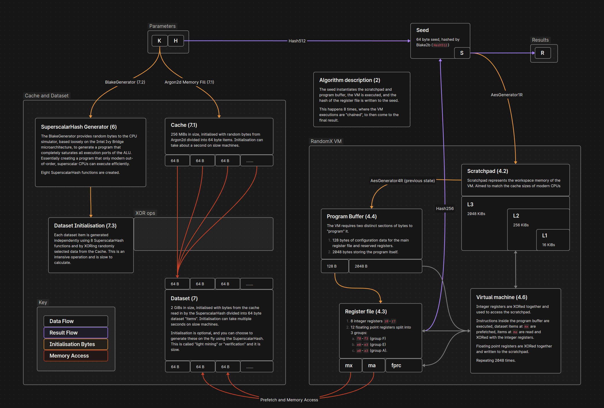

# RandomX.js

[RandomX.js](https://github.com/l1mey112/randomx.js) ([NPM](https://www.npmjs.com/package/randomx.js)) | [RandomWOW.js](https://github.com/l1mey112/randomx.js) ([NPM](https://www.npmjs.com/package/randomwow.js))

**RandomX.js is an implementation of the ubiquitous Monero POW algorithm RandomX in JavaScript.** Theorised by its creator and others to be near impossible to run on JS with only web standards, hashes are computed just fine. This is an attempt to build a RandomX implementation that is as fast as possible, compliant with the RandomX specification, simple to read and understand, and matches the reference API as closely as possible.

This project is a monorepo, containing NPM packages [RandomX.js](https://www.npmjs.com/package/randomx.js) and [RandomWOW.js](https://www.npmjs.com/package/randomwow.js). All are hosted here and built in one piece.

```ts
// npm i randomx.js
import { randomx_create_vm, randomx_init_cache } from 'randomx.js' // or 'randomx.js-shared'

const cache = randomx_init_cache('optional key')
const randomx = randomx_create_vm(cache)

console.log(randomx.calculate_hash('hello world')) // Uint8Array
```

> [RandomX](https://github.com/tevador/RandomX) is a proof-of-work (PoW) algorithm that is optimized for general-purpose CPUs. RandomX uses random code execution (hence the name) together with several memory-hard techniques to minimize the efficiency advantage of specialized hardware.

I recently presented a talk about RandomX and the internals of this library! Go watch it:

> [](https://www.youtube.com/watch?v=gmAgvHaw9w4)
> [Zero to RandomX.js: Bringing Webmining Back From The Grave - Linux Society UNSW 2025](https://www.youtube.com/watch?v=gmAgvHaw9w4)

```bash
scripts/build.ts
node examples/randomx.js
# machine id: AMD Ryzen 7 3800X 8-Core Processor [rx/0+relaxed-simd+fma] Node.js/v22.9.0 (linux x64)
# cache construction time 599.0 ms
# average hashrate: 26.3 H/s

bun examples/randomx.js
# machine id: AMD Ryzen 7 3800X 8-Core Processor [rx/0] Bun/1.1.29 (linux x64)
# cache construction time 793.8 ms
# average hashrate: 15.2 H/s

node examples/randomx_threaded.js
# machine id: AMD Ryzen 7 3800X 8-Core Processor [rx/0+relaxed-simd+fma] Node.js/v22.9.0 (linux x64)
# initialising thread 0..15
# average hashrate: 251.0 H/s

node examples/mining/server.js
# server running at http://localhost:8080/
# machine id: Generic 16-Thread CPU [rx/0+relaxed-simd+fma] Mozilla/5.0 (X11; Linux x86_64) AppleWebKit/537.36 (KHTML, like Gecko) Chrome/137.0.0.0 Safari/537.36
# average hashrate: 241.0 H/s

node -v; bun -v; chromium --version
# v25.2.1
# 1.2.16
# Chromium 137.0.7151.68 Arch Linux
```

Hashrate was speculated to be 1 H/s per thread, this beats it at still a pitiful 20 H/s. On the same machine, 100 H/s per thread is achieved when mining in light/verification mode, so 5x slower ain't that bad. Mining with an initialised dataset (2 GiB allocation) is not supported (though easy to implement), no one on earth would give a webpage multiple gigabytes of memory. **Light/verification mode only, ~~transparent threading is enabled by allocating the cache with the `shared` parameter.~~**

For threading (i.e., allocating the cache/dataset using shared memory), see the `*-shared` versions of the packages above.

[Do you want to help improve performance? Criticise, speculate, and provide insight here.](https://github.com/l1mey112/randomx.js/issues/1)

Appreciate the undertaking? Consider a donation.

| Crypto  | Donation Address |
| ------------- | ------------- |
| XMR  | 85vt1KvVz82Dd7AoVWXxnPCubutVT9NRNTAoxKFnXNpzcUfLFZ7rBtjbxonPTD5roE998XczLAoCrUD7tPS84AUQ8cZXHRM |
| WOW  | WW3asfacxETEgtUFVXGBfnJUqmMgNrVdWJTDouT63Ly4B1B9xiqj2g6bDPS8jZNn6pXY5pj4dnmTtL1gLRTAxXwz1LQhsua1R |

**WARNING:** Do not use this library with Bun to compute hashes in a "production" environment. I am seeing halts/freezes (50/50) and incorrect data (on some machines, 5/95). I have yet to place a bug report, just assume Bun isn't "production ready" yet. Just to run my test harness, `bun test` (which is quite nice), I often need to restart it to get past the `randomx.test.ts` and `randomxwow.test.ts` tests without freezing up. Other than that, Bun is pretty good.

## Implmentation

This codebase can be used to learn about RandomX, and its individual stages implemented with simple code. The library contains zero JavaScript dependencies, with pure freestanding C code that doesn't depend on a standard library.


Virtual machine executions use a JIT compiler ([superscalarhash](src/jit/jit_ssh.c), [randomx](src/jit/jit_vm.c)) to generate WASM on the fly, **the library does not use an interpreter.** The SuperscalarHash function can be used separately, with its implementation also being JIT code. To generate hashes the library calls into the JIT which hands back the code, which is then executed, repeating up till `RANDOMX_PROGRAM_COUNT` ([JS entrypoint](src/vm_single/vm.ts)).

- Example [RandomX Virtual Machine](media/randomx.wat) JIT code
- Example [SuperscalarHash](media/superscalarhash.wat) JIT code

Vector instructions are used where possible in the library ([argon2](src/argon2fill/argon2fill_v128.c), [semifloat](src/jit/stubs/semifloat.c)) and in JIT code, and AES-NI rounds are emulated in software ([softaes](src/aes/softaes.c)).

RandomX requires the use of multiple floating point rounding modes adjustable during VM execution, which are not supported in JavaScript. Performant emulations ([semifloat](src/jit/stubs/semifloat.c)) are used in place of these, which I am not opting to call "softfloat". A better name for these would be "semifloat", as they implement the rounding modes in terms of floating point operations rounded to nearest, not a typical softfloat that implements floating point using only integer operations. This libraries semifloat implementation is rigorously tested, with a 200k LOC test suite ([harness](tests/semifloat/semifloat_test.c)).

The library is entirely compliant with reference implementation, and all components been tested properly ([tests](tests), [harness](tests/harness.c), [harness wrapper](tests/harness.ts)). Reaching compliance was done by single stepping the virtual machine and diffing the state with the reference implementation ([breakpoint function](src/vm/vm.c), [JIT instrumentation](src/jit/jit_vm_inst.c)).

Below is a high level overview of how RandomX works, annotated with the specification headings.



# Build

On a system with `bun` and `node` **installed** and on the PATH, you'll need clang and WebAssembly tools as well:

```sh
apt install build-essential clang lld binaryen wabt
```

```sh
bun i
scripts/build.ts # calls into make and does everything else
node examples/randomx.js

bun run test-bun  # test using the bun runtime
bun run test-node # test using the node runtime
```
